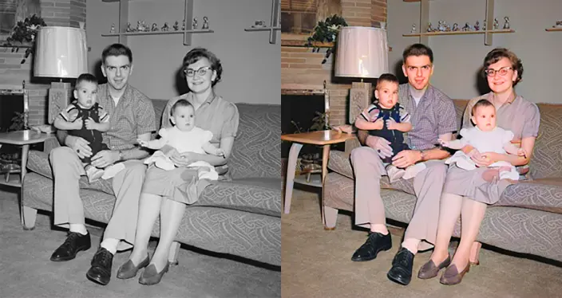

# GrayPhotoColorAI-color_old_photographs_using_autoencoder


Automatically colorize black and white photos using deep learning.



## What it does

Takes grayscale images and adds realistic colors using a U-Net neural network trained on 118,000 photos. Works on portraits, landscapes, objects - pretty much anything.

## Setup

```bash
git clone https://github.com/yourusername/NostalgiaColorAI.git
cd NostalgiaColorAI
pip install -r requirements.txt
```

**Requirements:** Python 3.8+, PyTorch 2.0+, GPU recommended

## Get the dataset

Download COCO 2017 from [Kaggle](https://www.kaggle.com/datasets/awsaf49/coco-2017-dataset) (~27GB)

Extract and move images:
- `train2017/*` → `data/train/`
- `val2017/*` → `data/val/`

For quick testing, use [CIFAR-10](https://www.kaggle.com/datasets/swaroopkml/cifar10-pngs-in-folders) instead (170MB)

## Train

```bash
python train.py
```

Takes 2-5 hours on a GPU. Watch progress with `tensorboard --logdir outputs/logs`

Custom settings:
```bash
python train.py --epochs 50 --batch_size 16 --image_size 256
```

Out of memory? Try: `python train.py --batch_size 8 --image_size 128`

## Colorize images

Single image:
```bash
python predict.py --checkpoint checkpoints/best_model.pth --input_image photo.jpg --show
```

Batch process:
```bash
python predict.py --checkpoint checkpoints/best_model.pth --input_dir photos/ --output_dir results/
```

## How it works

The model uses LAB color space:
- **L** = lightness (your grayscale image)
- **AB** = color channels (what the model predicts)

A U-Net architecture analyzes the grayscale input and predicts colors based on patterns learned from training data. So grass usually comes out green, sky comes out blue, etc.

## Results

What works well:
- Natural scenes and landscapes
- People and portraits
- Common objects

What struggles:
- Historically accurate colors (it guesses based on patterns, not facts)
- Unusual objects or weird lighting
- Very low quality images

The model makes educated guesses - a red car might turn blue if that's more common in the training data.

## Project structure

```
├── data/          # Training and validation images
├── models/        # U-Net architecture
├── utils/         # Preprocessing and visualization
├── train.py       # Training script
├── predict.py     # Colorization script
└── checkpoints/   # Saved models
```

## Tips

- Use 10,000+ diverse images minimum
- Train for 50+ epochs for good results
- Higher resolution (512x512) = better quality but needs more GPU memory
- Check that validation loss is decreasing

## License

MIT - do whatever you want with it

## Credits

Built using:
- [U-Net architecture](https://arxiv.org/abs/1505.04597)
- [LAB colorization approach](https://arxiv.org/abs/1603.08511)
- [COCO dataset](https://arxiv.org/abs/1405.0312)
